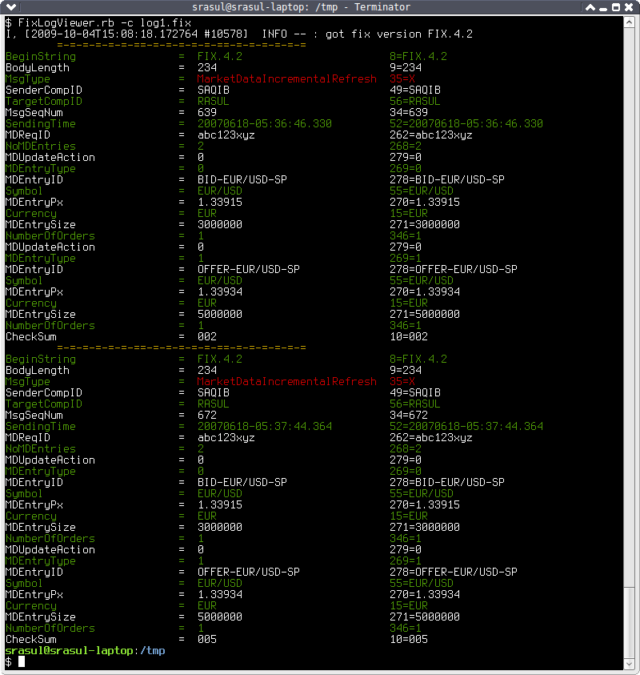

_This has not been updated since 2009. Not sure if this works now_

# Ruby Fix Message Viewer

## About

The FIX Message Viewer is a set of ruby scripts that parse [FIX (Financial Information eXchange protocol)](http://www.fixprotocol.org/) messages to display them in a more human-readable format. See the [Widipedia entry for FIX](http://en.wikipedia.org/wiki/Financial_Information_eXchange) for more information the FIX protocol.

The Viewer can only parse FIX messages in a file or from STDIN. It also expects a full FIX message on each line. The FIX message can be prefixed with a timestamp, but this will be ignored.

The output is colored to make it easier to read and the MsgType field is highlighted.

The log viewer works on the command line (only) and requires Ruby installed.

## Download & Install
Install the ruby term-ansicolor gem:

```
$ sudo gem install term-ansicolor
```

Download the scripts from this github.

### Install
On your trusty bash shell:
```bash
cd /path/to/FixLogViewer
chmod +x FixLogViewer.rb
```
Next you need to put the `FixLogViewer.rb` script in your `PATH`. I have the following directory in my `PATH`: `$HOME/bin`. So I just sym linked the FixLogViewer.rb file in this directory.

Now you need to create an environment variable called `FLV_HOME` that point to the directory where `FixLogViewer.rb` lives. Then you need to put this environment variable in your `.bashrc`:
```bash
# PUT THIS IN YOUR .bashrc
export FLV_HOME=/my/apps/FixLogViewer
# PUT THIS IN YOUR .bashrc
```
Now open a new terminal to test:
```
$ env | grep FLV_HOME
$ which FixLogViewer.rb
```
Thats it!

## Usage
Usage:
```
$ FixLogViewer.rb --help
Usage: FixLogViewer.rb [options] [fixlogfile]
    -c, --color                      Generate color output
    -v, --verbose                    Generate verbose debug output (useful for reporting/debugging errors)
    -h, --help                       Display help message
if fixlogfile is - then read fix logs from STDIN
```
The output is 3 columns: Field Name, Field Value, original field and value (useful for searching). The `MsgType`‘s value is presented as the message name rather than its symbol.
### Here is a example
```
$ cat log1.fix
[18.06.07 07:36:46.375] FIX.4.2:RASUL->SAQIB: 8=FIX.4.29=23435=X49=SAQIB56=RASUL34=63952=20070618-05:36:46.330262=abc123xyz268=2279=0269=0278=BID-EUR/USD-SP55=EUR/USD270=1.3391515=EUR271=3000000346=1279=0269=1278=OFFER-EUR/USD-SP55=EUR/USD270=1.3393415=EUR271=5000000346=110=002
[18.06.07 07:37:44.408] FIX.4.2:RASUL->SAQIB: 8=FIX.4.29=23435=X49=SAQIB56=RASUL34=67252=20070618-05:37:44.364262=abc123xyz268=2279=0269=0278=BID-EUR/USD-SP55=EUR/USD270=1.3391515=EUR271=3000000346=1279=0269=1278=OFFER-EUR/USD-SP55=EUR/USD270=1.3393415=EUR271=5000000346=110=005

$ FixLogViewer.rb log1.fix
I, [2009-10-04T15:07:30.262018 #10554]  INFO -- : got fix version FIX.4.2
        =-=-=-=-=-=-==-=-=-=-=-=-==-=-=-=-=-=-=
BeginString                =  FIX.4.2                       8=FIX.4.2
BodyLength                 =  234                           9=234
MsgType                    =  MarketDataIncrementalRefresh  35=X
SenderCompID               =  SAQIB                         49=SAQIB
TargetCompID               =  RASUL                         56=RASUL
MsgSeqNum                  =  639                           34=639
SendingTime                =  20070618-05:36:46.330         52=20070618-05:36:46.330
MDReqID                    =  abc123xyz                     262=abc123xyz
NoMDEntries                =  2                             268=2
MDUpdateAction             =  0                             279=0
MDEntryType                =  0                             269=0
MDEntryID                  =  BID-EUR/USD-SP                278=BID-EUR/USD-SP
Symbol                     =  EUR/USD                       55=EUR/USD
MDEntryPx                  =  1.33915                       270=1.33915
Currency                   =  EUR                           15=EUR
MDEntrySize                =  3000000                       271=3000000
NumberOfOrders             =  1                             346=1
MDUpdateAction             =  0                             279=0
MDEntryType                =  1                             269=1
MDEntryID                  =  OFFER-EUR/USD-SP              278=OFFER-EUR/USD-SP
Symbol                     =  EUR/USD                       55=EUR/USD
MDEntryPx                  =  1.33934                       270=1.33934
Currency                   =  EUR                           15=EUR
MDEntrySize                =  5000000                       271=5000000
NumberOfOrders             =  1                             346=1
CheckSum                   =  002                           10=002
        =-=-=-=-=-=-==-=-=-=-=-=-==-=-=-=-=-=-=
BeginString                =  FIX.4.2                       8=FIX.4.2
BodyLength                 =  234                           9=234
MsgType                    =  MarketDataIncrementalRefresh  35=X
SenderCompID               =  SAQIB                         49=SAQIB
TargetCompID               =  RASUL                         56=RASUL
MsgSeqNum                  =  672                           34=672
SendingTime                =  20070618-05:37:44.364         52=20070618-05:37:44.364
MDReqID                    =  abc123xyz                     262=abc123xyz
NoMDEntries                =  2                             268=2
MDUpdateAction             =  0                             279=0
MDEntryType                =  0                             269=0
MDEntryID                  =  BID-EUR/USD-SP                278=BID-EUR/USD-SP
Symbol                     =  EUR/USD                       55=EUR/USD
MDEntryPx                  =  1.33915                       270=1.33915
Currency                   =  EUR                           15=EUR
MDEntrySize                =  3000000                       271=3000000
NumberOfOrders             =  1                             346=1
MDUpdateAction             =  0                             279=0
MDEntryType                =  1                             269=1
MDEntryID                  =  OFFER-EUR/USD-SP              278=OFFER-EUR/USD-SP
Symbol                     =  EUR/USD                       55=EUR/USD
MDEntryPx                  =  1.33934                       270=1.33934
Currency                   =  EUR                           15=EUR
MDEntrySize                =  5000000                       271=5000000
NumberOfOrders             =  1                             346=1
CheckSum                   =  005                           10=005
```

### Sample output colored

### More usage examples
```
# Color output:
$ FixLogViewer.rb -c somelogfile.fix

# Color output piped to less for paging/searching:
$ FixLogViewer.rb -c somelogfile.fix | less -r

# Grep the logs and then view them:
$ grep "35=8" somelogfile.fix | FixLogViewer.rb -c -
```

## Configuring QuickfixJ to produce FIX Message Logs
A great Open Source Library for FIX is [QuickFixJ](https://www.quickfixj.org/). To get QuickFixJ to output all FIX messages sent/received into a separate file that can then be parsed by this Fix Log Viewer, put the following in your QuickFixJ Log4j config:
```
# fixmessage configuration
log4j.appender.fixmessage=org.apache.log4j.DailyRollingFileAppender
log4j.appender.fixmessage.File=fixmessage.log
log4j.appender.fixmessage.layout=org.apache.log4j.PatternLayout
# set pattern to just "[Date] message"
log4j.appender.fixmessage.layout.ConversionPattern=%d{[dd.MM.yy HH:mm:ss.SSS]} %m%n

#set quickfix.msg category to DEBUG (This category reaches just the FIX messages)
log4j.logger.quickfixj.msg=DEBUG, fixmessage
log4j.additivity.quickfixj.msg=false
```